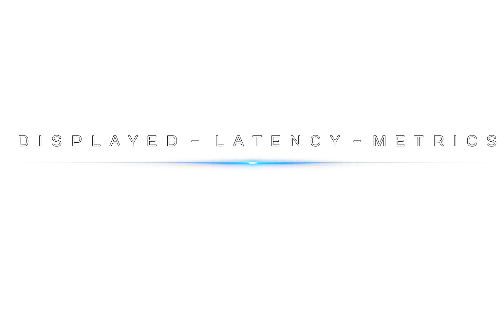

<div align="center">



**Real-time frame presentation, display-latency, GPU/CPU timing and stutter analysis for Windows.**

<br>

[](https://learn.microsoft.com/dotnet/csharp/)
[](https://dotnet.microsoft.com/)
[](https://developer.mozilla.org/docs/Web/HTML)
[](https://www.microsoft.com/windows)
[](https://github.com/GameTechDev/PresentMon)

</div>

---

## Overview

**DISPLAYED-LATENCY-METRICS** is a Windows telemetry and overlay application focused on the part of frame performance that ordinary FPS counters do not show clearly: **when frames are presented, when they are actually displayed, how stable that timing is, and where latency or stutter is introduced**.

The project captures PresentMon frame data, converts it into application-level samples, maintains rolling swap-chain windows, calculates render/display/CPU statistics, and publishes the resulting metrics through the overlay layer.

The codebase is written primarily in **C# / .NET 10** and also contains embedded **HTML** assets used by the application UI.

---

## Main features

- Real-time PresentMon frame telemetry.
- Per-process / swap-chain frame tracking.
- Render, display and CPU timing metrics.
- Display-latency statistics.
- Standard deviation and RMSSD frame-pacing analysis.
- Stepwise relative display-timing analysis.
- CapFrameX-style stutter analysis.
- Presentation / compositing mode reporting.
- Native Windows overlay implementation.
- RTSS overlay publishing path.
- Configurable overlay and application settings.
- Embedded HTML-based menu / README resources.
- Windows x64 / .NET 10 application architecture.

---

## Metrics

The metric engine is split into dedicated definitions instead of merging unrelated timing data into a single score.

### Presentation

| Metric | Description |
|---|---|
| `PresentMode` | Current frame presentation / compositing mode. |
| `AverageMsBetweenPresents` | Average interval between application presents. |
| `MsBetweenPresents SD` | Standard deviation of present intervals. |
| `Rendered RMSSD` | Successive-difference variation of render/present timing. |

### Display

| Metric | Description |
|---|---|
| `MsUntilDisplayed` | Time from the relevant presentation point until the frame is displayed. |
| `AverageDisplayLatency` | Average display latency over the active sample window. |
| `DisplayLatency SD` | Standard deviation of display latency. |
| `DisplayLatency RMSSD` | Short-term frame-to-frame display-latency variation. |
| `AverageMsBetweenDisplayChange` | Average interval between displayed-frame changes. |
| `MsBetweenDisplayChange SD` | Standard deviation of displayed-frame intervals. |
| `MsUntilDisplayed SD` | Standard deviation of `MsUntilDisplayed`. |
| `MsUntilDisplayed RMSSD` | RMSSD of `MsUntilDisplayed`. |
| `Displayed RMSSD` | Successive-difference variation of displayed timing. |
| `Displayed Stepwise-Relative` | Stepwise relative representation of displayed-frame timing. |

### GPU / render

| Metric | Description |
|---|---|
| `AverageMsGPUBusy` | Average time during which the GPU is busy for the measured frames. |
| `AverageMsGPUTime` | Average GPU execution time. |
| `AverageMsGPUWait` | Average GPU wait component. |
| `AverageMsGPULatency` | Average GPU-related latency component. |

### CPU

| Metric | Description |
|---|---|
| `CpuBusy` | CPU busy timing component. |
| `CpuWait` | CPU wait timing component. |
| `AverageMsBetweenAppStart` | Average interval derived from application frame-start timing. |

### Stutter analysis

| Metric | Description |
|---|---|
| `Stutter Frames` | Portion/count of frames classified as stutter by the analysis layer. |
| `Stutter Time %` | Percentage of captured time attributed to stutter. |

The stutter implementation lives in `Metrics/CapFrameXStutterAnalysis.cs`, with the resulting values exposed through independent metric definitions.

---

## Statistical analysis

Several metrics use rolling statistical aggregates implemented in `ScalarStatistics` and `StatisticsMath`.

### Average

```text
Average = Σx / N
```

### Standard deviation

```text
SD = sqrt( Σ(xᵢ - μ)² / N )
```

Standard deviation describes dispersion around the mean and is useful for detecting unstable timing even when the average value looks normal.

### RMSSD

```text
RMSSD = sqrt( Σ(xᵢ₊₁ - xᵢ)² / (N - 1) )
```

**Root Mean Square of Successive Differences** emphasizes changes between consecutive samples. For frame-time analysis this is useful because short pacing disturbances can be visible in RMSSD without being obvious from the average alone.

---

## Data flow

```text
PresentMon
    │
    ▼
PresentMonApi / PresentMonRuntime
    │
    ▼
PresentMonFrameDecoder
    │
    ▼
FrameSample
    │
    ▼
CaptureCoordinator
    │
    ├── SwapChainSelector
    ├── SwapChainWindow
    └── FrameWindowStore
    │
    ▼
MetricContextBuilder
    │
    ▼
MetricEngine / MetricRegistry
    │
    ▼
MetricSnapshot
    │
    ├── NativeOverlayWindow
    └── RtssOverlayPublisher
```

This separation keeps capture, window management, calculations and rendering independent from each other.

---

## Project architecture

```text
src/
├── App/
│   ├── AppSettings.cs
│   ├── DependencyBootstrapper.cs
│   ├── EmbeddedWebAssets.cs
│   ├── OverlaySettings.cs
│   ├── OverlaySettingsWindow.cs
│   ├── ReadmeWindow.cs
│   ├── StartupSplashWindow.cs
│   ├── StartupState.cs
│   ├── TrayApplication.cs
│   └── UiTheme.cs
│
├── Assets/
│   ├── image.png
│   ├── menu.html
│   ├── readme.html
│   └── JetBrainsMonoNL-Regular.ttf
│
├── Capture/
│   ├── CaptureCoordinator.cs
│   ├── FrameMetricsPipeline.cs
│   ├── FrameSample.cs
│   ├── MetricContextBuilder.cs
│   ├── PresentMonFrameDecoder.cs
│   └── Windowing/
│       ├── FrameWindowStore.cs
│       ├── SwapChainSelector.cs
│       └── SwapChainWindow.cs
│
├── Infrastructure/
│   └── Logger.cs
│
├── Interop/
│   ├── PresentMonApi.cs
│   ├── PresentMonRuntime.cs
│   └── Win32.cs
│
├── Metrics/
│   ├── CapFrameXStutterAnalysis.cs
│   ├── IMetric.cs
│   ├── MetricContext.cs
│   ├── MetricEngine.cs
│   ├── MetricFlags.cs
│   ├── MetricRegistry.cs
│   ├── MetricSnapshot.cs
│   ├── MetricValue.cs
│   ├── MetricValueFormatter.cs
│   ├── ScalarStatistics.cs
│   ├── StatisticsMath.cs
│   └── Definitions/
│       ├── Analysis/
│       ├── Cpu/
│       ├── Display/
│       ├── Presentation/
│       └── Render/
│
├── Overlay/
│   ├── NativeOverlayWindow.cs
│   ├── OverlayFormatter.cs
│   ├── OverlayPreviewData.cs
│   └── RtssOverlayPublisher.cs
│
├── Program.cs
├── app.manifest
├── DISPLAYED-LATENCY-METRICS.csproj
└── DISPLAYED-LATENCY-METRICS.slnx
```

---

## Core components

### Capture layer

`CaptureCoordinator` controls the acquisition path. Raw PresentMon data is decoded by `PresentMonFrameDecoder` into `FrameSample` objects and passed into the rolling-window pipeline.

`Capture/Windowing` is responsible for selecting the relevant swap chain and keeping the frame history used by the metric engine.

### Metric engine

The metric subsystem is intentionally modular:

- `IMetric` defines the metric contract.
- `MetricRegistry` owns the available metric definitions.
- `MetricContext` contains the data required for a calculation pass.
- `MetricContextBuilder` builds that context from captured frame windows.
- `MetricEngine` evaluates registered metrics.
- `MetricSnapshot` stores the resulting values for presentation.
- `MetricFlags` controls metric selection / availability.

Each metric lives in its own definition file, which keeps display, render, CPU and analysis logic separated.

### PresentMon interop

The project contains its own integration layer around PresentMon:

```text
Interop/PresentMonApi.cs
Interop/PresentMonRuntime.cs
Capture/PresentMonFrameDecoder.cs
```

This keeps native telemetry interaction separate from the higher-level metric logic.

### Overlay

The output layer contains both a native overlay window and an RTSS publishing implementation:

```text
Overlay/NativeOverlayWindow.cs
Overlay/RtssOverlayPublisher.cs
Overlay/OverlayFormatter.cs
```

`OverlayFormatter` converts calculated metric snapshots into their final presentation form.

### Embedded UI

HTML resources are stored directly in the project:

```text
Assets/menu.html
Assets/readme.html
```

They are integrated through `App/EmbeddedWebAssets.cs` and used by the application's UI layer.

---

## Technology stack

| Area | Technology |
|---|---|
| Main language | **C#** |
| Runtime | **.NET 10** |
| Embedded UI content | **HTML5** |
| Platform | **Windows x64** |
| Native integration | **Win32 / P/Invoke** |
| Frame telemetry | **PresentMon** |
| Overlay output | **Native overlay / RTSS** |
| Font asset | **JetBrains Mono NL** |

---

## Build

### Requirements

- Windows 10 or Windows 11 x64
- .NET 10 SDK
- Visual Studio 2022/2026 or `dotnet` CLI
- PresentMon runtime/components required by the application
- RTSS only when using the RTSS publishing path

### Build with .NET CLI

```powershell
dotnet restore .\src\DISPLAYED-LATENCY-METRICS.csproj
dotnet build .\src\DISPLAYED-LATENCY-METRICS.csproj -c Release
```

### Publish for Windows x64

```powershell
dotnet publish .\src\DISPLAYED-LATENCY-METRICS.csproj -c Release -r win-x64
```

If Native AOT is enabled by the project configuration, the publish step will use the corresponding settings from the `.csproj`.

---

## Why not just FPS?

FPS is an aggregate throughput value. Two captures can report the same average FPS while producing noticeably different frame delivery.

DISPLAYED-LATENCY-METRICS therefore keeps several different timing domains visible independently:

```text
Application timing
      │
      ├── CPU busy / wait
      ├── time between presents
      │
      ▼
GPU execution
      │
      ├── GPU busy
      ├── GPU time
      ├── GPU wait
      └── GPU latency
      │
      ▼
Presentation
      │
      ▼
Actual display timing
      │
      ├── MsUntilDisplayed
      ├── MsBetweenDisplayChange
      ├── DisplayLatency
      └── pacing / stutter statistics
```

This makes the overlay more useful for diagnosing **frame pacing and end-to-end presentation behaviour**, rather than treating every problem as an FPS problem.

---

## References

- [Intel PresentMon](https://github.com/GameTechDev/PresentMon) — frame-presentation telemetry used by the capture layer.
- [CapFrameX](https://github.com/CXWorld/CapFrameX) — reference project for frame-time and stutter analysis concepts.
- [.NET](https://dotnet.microsoft.com/) — application runtime and toolchain.
